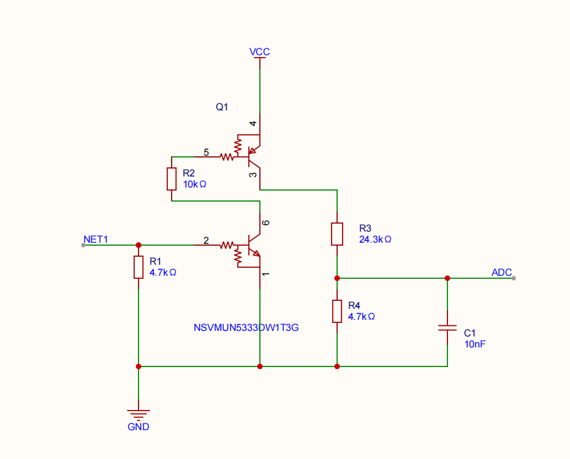
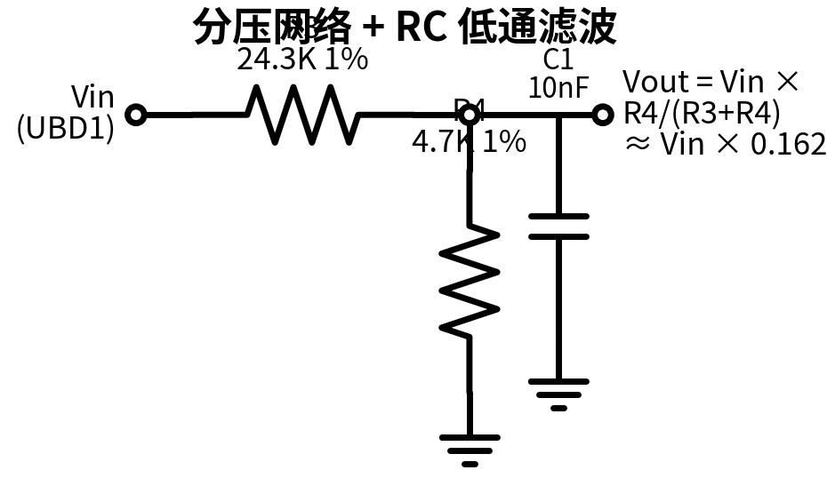
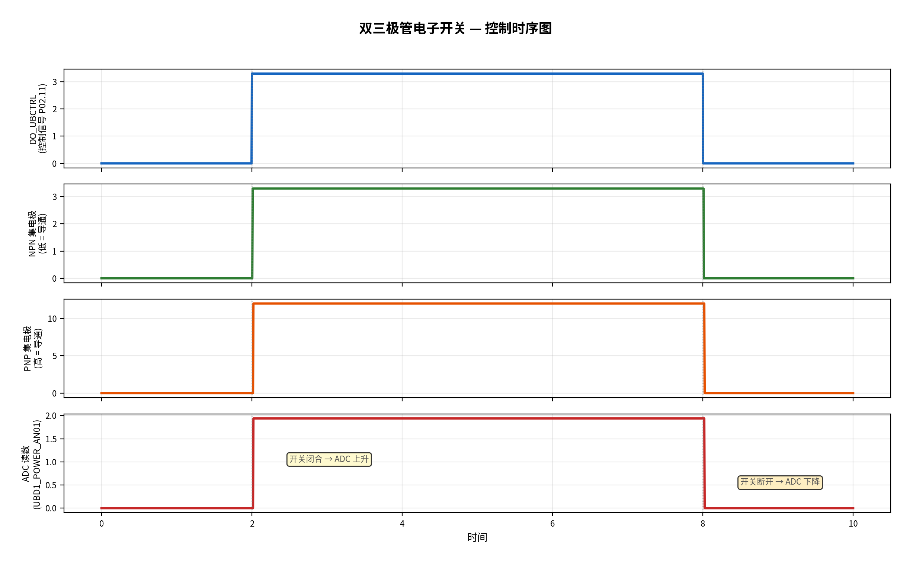
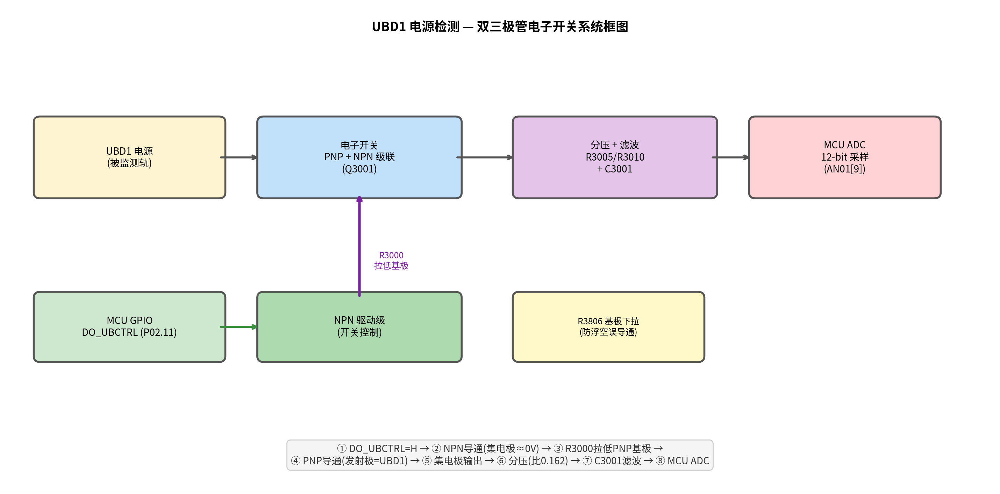

# 电路 01 — UBD1 双三极管电子开关

> **项目**：ZCU 区域控制单元 | **子系统**：电源管理
> **核心架构**：双三极管电子开关 → ADC 采样
> **设计日期**：2026

---

## 📌 一句话说清

**用双三极管搭了一个受控电子开关**——把 UBD1 电源电压引出来，分压后送 MCU ADC 采样。不检测的时候开关断开，零功耗。

---

## 📐 原理图

---

## ⚡ 核心原理

这个电路的本质是**一个受控电子开关 + 分压网络**，由两个三极管配合完成：

| 三极管 | 功能 |
|:--|:--|
| **Q1** | 开关驱动——控制整个电路的通断时机 |
| **Q2** | 信号通路——导通后把 UBD1 电压传递到分压网络 |

### 工作逻辑

**检测开启**：控制信号有效 → Q1 导通 → 驱动 Q2 → Q2 导通 → UBD1 电压经 R3/R4 分压 → C1 滤波 → ADC

**检测关闭**：控制信号无效 → Q1 截止 → Q2 截止 → 无输出 → 不耗电

---

## 📐 分压网络

分压比：

$$
V_{ADC} = V_{UBD1} \times \frac{R_4}{R_3 + R_4} \approx V_{UBD1} \times 0.162
$$

**典型值**：

| UBD1 | ADC 电压 | 12-bit ADC code (3.3Vref) |
|:--|:--|:--|
| 5V | 0.81V | ~1005 |
| 12V | 1.94V | ~2410 |
| 18V | 2.92V | ~3623 |

---

## 🧠 设计深度问答

### Q1：为什么要用两个三极管级联，不能单管搞定吗？

**一句话：MCU 的 3.3V GPIO 没办法直接控制 12V 电源轨上的开关。**

| 方案 | 问题 |
|:--|:--|
| 单 NPN 做高边开关 | NPN 导通需要 $V_{BE}>0.7V$，发射极在 12V → 基极需 ~12.7V，MCU 只有 3.3V ❌ |
| 单 PNP 做高边开关 | PNP 截止需要 $V_{BE}\approx 0$（基极≈发射极），MCU 最高输出 3.3V，远低于 12V，无法让 PNP 截止 ❌ |

**加一级就通了**：NPN 把 3.3V 的小信号翻译成「把某个节点拉到 0V」——0V 足够让 PNP 的 $V_{EB}\approx 12V$，可靠导通。第一级（NPN）做电平转换，第二级（PNP）做功率开关，各司其职。

---

### Q2：为什么用三极管而不是 MOSFET？

| | BJT | MOSFET |
|:--|:--|:--|
| 导通条件 | $V_{BE}>0.7V$ | $V_{GS}>V_{th}$（通常 1~3V） |
| 3.3V GPIO 驱动 | ✅ 轻松 | ⚠️ 需逻辑电平型 |
| 成本 | 几分钱 | 几毛钱 |
| 本场景适用性 | 负载 ~29KΩ，电流 <0.5mA | 杀鸡用牛刀 |

这个电路负载极轻——只是给 29KΩ 分压电阻供电，电流不到 0.5mA。BJT 完全够用，没必要上 MOSFET。**唯一可能用 MOSFET 的理由**：如果未来要驱动大电流负载。

---

### Q3：三极管在这里的优势是什么？

- **驱动简单**：$V_{BE}\approx 0.7V$ 就导通，3.3V GPIO 轻松驾驭
- **便宜**：几分钱 vs MOSFET 几毛钱
- **双管合封**：NSVMUN5333DW1T1G 一颗 SOT-363 含 NPN+PNP，省 PCB 面积
- **内置偏置电阻（BRT）**：R1/R2 做在芯片里，外围少两个电阻
- **车规**：AEC-Q101，-40~125°C

---

### Q4：选三极管要考虑什么参数？

| 参数 | 含义 | 本电路考量 |
|:--|:--|:--|
| **$V_{CEO}$** | 集电极-发射极耐压 | UBD1 最高 12V → 选 ≥30V（MUN5333 为 50V） |
| **$I_{C(max)}$** | 最大集电极电流 | 负载 ~0.5mA → 随便选（MUN5333 100mA） |
| **$h_{FE}$** | 电流增益 | 确保基极电流够驱动负载 |
| **$V_{CE(sat)}$** | 饱和压降 | 越小越好，影响检测精度 |
| **封装** | — | SOT-363 双管合封 |
| **内置偏置电阻** | BRT 特性 | 减少 BOM |
| **车规认证** | AEC-Q101 | ZCU 是车载项目 |
| **温度范围** | — | -40~125°C |

---

### Q5：基极和发射极的饱和压降一般是多少？

| 参数 | 小信号管 | 功率管 | 达林顿管 |
|:--|:--|:--|:--|
| $V_{BE(sat)}$ | 0.7V ~ 0.85V | 0.8V ~ 1.2V | 1.2V ~ 1.4V |
| $V_{CE(sat)}$ | 0.1V ~ 0.3V | 0.3V ~ 1V | 0.7V ~ 1.5V |

> 💡 **$V_{BE}$ 永远是 ~0.7V**。不管饱和还是放大，硅管基极-发射极导通就是 0.6~0.7V，深度饱和到 0.75~0.85V。**$V_{CE(sat)}$ 看负载电流**，小电流（mA 级）可以低到 0.05~0.1V。

NSVMUN5333DW1T1G datasheet 典型值：

| 参数 | 条件 | 典型值 | 最大值 |
|:--|:--|:--|:--|
| $V_{CE(sat)}$ NPN | $I_C$=10mA, $I_B$=0.5mA | **0.06V** | 0.25V |
| $V_{CE(sat)}$ PNP | $I_C$=10mA, $I_B$=0.5mA | **0.15V** | 0.4V |

本电路 PNP 集电极电流仅 ~0.4mA，$V_{CE(sat)}$ 实际更低，精度分析按 0.1V 算已经很保守。

---

### Q6：小信号管、功率管、达林顿管有什么区别？

| | 小信号管 | 功率管 | 达林顿管 |
|:--|:--|:--|:--|
| 管啥用 | 放大信号 | 扛大电流 | 超高增益 |
| 电流 | mA 级 | A 级 | A 级（小基极电流驱动） |
| $h_{FE}$ | 100~300 | 20~50 | 1000~30000 |
| $V_{CE(sat)}$ | ~0.1V | ~0.5V | ~1V |
| 体积 | 米粒大小 | 带散热片 | 中小封装 |
| 例子 | 2N3904、MUN5333 | TIP31C、2N3055 | TIP122、ULN2003 |

> 🔑 你电路里的 NSVMUN5333DW1T1G 是**小信号管**——负载只有 0.4mA，用功率管属于开坦克买菜。
>
> **达林顿管**本质是两个三极管叠起来：$h_{FE} \approx h_{FE1} \times h_{FE2}$，超高增益；代价是 $V_{CE(sat)}$ 也翻倍（两个 $V_{BE}$ 串联 ≈ 1.2~1.4V）。

---

### Q7：为什么下拉电阻选 4.7K？

这是一个三角形权衡：

| 取值 | 后果 |
|:--|:--|
| 太小（如 1K） | $I=3.3V/1K=3.3mA$，浪费电流，GPIO 驱动压力大 |
| 太大（如 100K） | MCU 复位/高阻态时下拉太弱，噪声或漏电流可能让基极浮起 → 误导通 → 误检测 |
| **4.7K**（折中） | $I=3.3V/4.7K \approx 0.7mA$：够强压制噪声，不费电（GPIO 典型驱动 4~8mA），常用值 BOM 顺手 |

> 🔑 **核心逻辑**：MCU 复位期间 GPIO 是高阻态，如果没有下拉，NPN 基极浮空 = 不确定 = 可能误导通。4.7K 下拉把基极牢牢钉在 0V，确保「不控制的时候就关断」。

---

## 🔧 器件清单

| 编号 | 参数 | 说明 |
|:--|:--|:--|
| Q1, Q2 | NSVMUN5333DW1T1G | 双三极管（车规 AEC-Q101） |
| R1 | 4.7KΩ | 输入偏置 |
| R2 | 10KΩ | 级联/驱动 |
| R3 | 24.3KΩ 1% | ADC 分压上臂 |
| R4 | 4.7KΩ 1% | ADC 分压下臂 |
| C1 | 10nF | ADC 滤波 |

### C1 — RC 低通滤波

等效输出阻抗：

$$
R_{eq} = R_3 \parallel R_4 \approx 3.94\text{K}
$$

截止频率：

$$
f_{-3dB} = \frac{1}{2\pi \times R_{eq} \times C_1} \approx 4.0\text{ kHz}
$$

### 精度预算

| 误差源 | 值 | 贡献 |
|:--|:--|:--|
| R3 公差 | ±1% | ±1% |
| R4 公差 | ±1% | ±1% |
| ADC 量化 | 12-bit | 可忽略 |
| **总 RSS** | — | **±1.4%** |

---

## 🎯 信号时序

| 阶段 | 控制信号 | Q1 | Q2 | ADC |
|:--|:--|:--|:--|:--|
| 空闲 | 无效 | 截止 | 截止 | 0V |
| 开关闭合 | 有效 | 导通 | 导通 | RC 上升 |
| 稳定检测 | 有效 | 导通 | 导通 | 稳定值 |
| 开关断开 | 无效 | 截止 | 截止 | RC 下降 |

> ⚠️ ADC 采样需等 RC 稳定后再读，软件加适当延时。

---

## 🛠 调试指南

### 故障 1：ADC 恒为 0

| 检查点 | 排查 |
|:--|:--|
| UBD1 端 | 被测电源是否正常 |
| Q1 基极 | 控制信号是否到位 |
| Q2 基极 | Q1 是否正常驱动 |
| 分压输出 | R3/R4 是否虚焊 |

### 故障 2：ADC 读数跳动

- C1 虚焊/缺失 → 无滤波
- 走线耦合噪声 → 软件加滑动平均

### 故障 3：空闲时 ADC 仍有读数

- 三极管漏电？
- 基极浮空导致误导通？

---

## 📊 系统框图

---

## 🎓 面试话术

### 30 秒版本

> "我做了一个双三极管电子开关用于车载 ZCU 电源检测。两个三极管级联——一个做驱动，一个做功率通路。控制信号导通后，UBD1 电压经分压送 ADC 采样。不检测时开关断开，零功耗。"

### 展开版

> "电路核心是双三极管级联结构——Q1 驱动 Q2，把 UBD1 电源电压传递给分压网络。R3/R4 分压比 0.162，C1 做 RC 低通（4kHz），送 12-bit ADC。选型上车规级双三极管 NSVMUN5333DW1T1G，一颗料搞定。精度 ±1.4%。"

### 体现的能力

- **模电基本功** — BJT 开关、分压网络、RC 滤波
- **工程思维** — 使能控制降功耗、精度预算
- **系统观** — 电源管理在车载架构中的位置

---

## 📝 适用范围

| 维度 | 参数 |
|:--|:--|
| 输入电压 | 3.3V ~ 18V |
| 检测精度 | ±1.4% |
| 工作温度 | -40 ~ +125°C（车规） |
| 功耗 | 检测时 <1mW，空闲时 0mW |

---

## 📝 参考资料

- NSVMUN5333DW1T1G datasheet
- ZCU 项目 BOM / 原理图源文件

---

> 📅 创建：2026-06-14 | 修订：v6（使用天哥手绘原理图）
