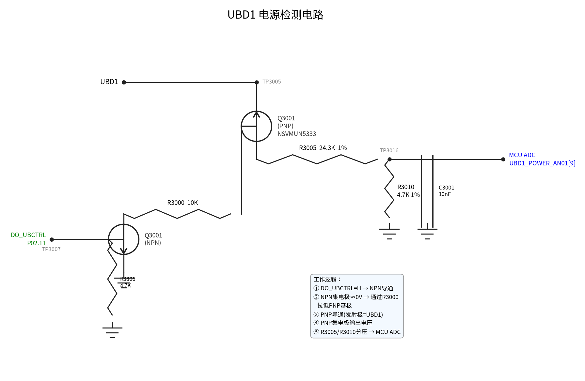

# 电路 01 — UBD1 电源检测电路

> **项目**：ZCU（区域控制单元）
> **功能模块**：电源管理 → 电源状态检测
> **设计日期**：2026

---

## 📌 电路功能

### 在 ZCU 中的角色

ZCU 作为区域控制单元，管理多路电源轨。**UBD1 电源检测电路**负责实时监测 UBD1 电源轨的状态，将结果反馈给 MCU，用于：

1. **上电时序控制** — 确认 UBD1 上电成功后，才使能下游电路
2. **故障诊断** — 运行时若 UBD1 掉电/欠压，MCU 立即感知并进入安全状态
3. **功能安全 (FuSa)** — 在 ISO 26262 场景下，电源监控是安全机制的关键一环

### 双三极管使能检测架构

该电路采用 **PNP + NPN 双三极管**结构实现受控电源检测：

| 器件 | 角色 | 功能 |
|:--|:--|:--|
| **Q3001 PNP** | 电源开关管 | 发射极接 UBD1，导通后将电压输出到分压网络 |
| **Q3001 NPN** | 使能控制管 | 受 MCU 的 DO_UBCTRL 信号控制，决定 PNP 是否导通 |
| **R3000 (10K)** | 级联电阻 | NPN 集电极 → PNP 基极，传递控制信号 |
| **R3806 (4.7K)** | 基极下拉 | 确保 DO_UBCTRL 浮空时 NPN 可靠截止 |
| **R3005/R3010** | 分压网络 | 24.3K + 4.7K，分压比 0.162，送到 MCU ADC |
| **C3001 (10nF)** | 滤波电容 | 滤除 ADC 输入噪声 |

> 💡 **设计亮点**：通过 DO_UBCTRL 使能信号控制检测时机——只在需要检测时才导通 PNP，平时 PNP 截止，不消耗 UBD1 电流（省电）。

---

## ⚡ 工作原理

```
DO_UBCTRL = H (MCU 发起检测)
  → NPN 导通 → NPN 集电极 ≈ 0V
  → R3000 将 PNP 基极拉低
  → PNP 导通 (发射极 = UBD1, 集电极输出)
  → R3005/R3010 分压 (比 0.162)
  → C3001 滤波
  → MCU ADC 采集电压值

DO_UBCTRL = L (空闲)
  → NPN 截止 → PNP 基极浮高 → PNP 截止
  → 无输出，不耗电
```

---

## 📐 原理图

### 完整电路



### 分压网络


### 系统框图


分压比：

$$
V_{ADC} = V_{PNP\_out} \times \frac{R_{3010}}{R_{3005} + R_{3010}} = V_{PNP\_out} \times \frac{4.7\text{K}}{24.3\text{K} + 4.7\text{K}} \approx V_{PNP\_out} \times 0.162
$$

PNP 导通后，$V_{PNP\_out} \approx V_{UBD1}$（忽略 VCE(sat)），因此：

**例**：UBD1 = 12V → ADC 读 ~1.94V，MCU 反算 $V_{UBD1} = V_{ADC} / 0.162$

---

## 🔧 器件清单与选型分析

### BOM

| 参考编号 | 类型 | 参数/型号 | 封装 | 功能 |
|:--|:--|:--|:--|:--|
| Q3001 | 双三极管 | NSVMUN5333DW1T1G | SOT-363 | PNP 开关 + NPN 使能控制 |
| R3000 | 电阻 | 10KΩ | 0402 | NPN 集电极到 PNP 基极 |
| R3806 | 电阻 | 4.7KΩ | 0402 | NPN 基极下拉 |
| R3005 | 电阻 | 24.3KΩ 1% | 0402 | ADC 分压上臂 |
| R3010 | 电阻 | 4.7KΩ 1% | 0402 | ADC 分压下臂 |
| C3001 | 电容 | 10nF 50V | 0402 | ADC 输入滤波 |
| TP3000/3005/3007/3016 | 测试点 | — | — | 调试/生产测试 |

### Q3001 选型分析

**型号**：ON Semiconductor **NSVMUN5333DW1T1G** — 内置 NPN+PNP 双晶体管，带偏置电阻（BRT）

**选型理由**：

1. **双管合封** — 一颗料搞定 PNP 开关 + NPN 控制，省 PCB 面积
2. **内置偏置电阻** — 简化外围电路，减少 BOM 项数
3. **AEC-Q101 认证** — 车规级，-40°C ~ +125°C
4. **NSV 前缀** — ON Semi 车规产品线

### R3005/R3010 分压比选择

分压比 $0.162$ 的设计考量：

| UBD1 电压 | ADC 读值 (12-bit, 3.3Vref) | ADC code |
|:--|:--|:--|
| 5V | 0.81V | ~1005 |
| 12V | 1.94V | ~2410 |
| 24V | 3.89V | **超量程 ❌** |

> ⚠️ 分压比选 0.162 说明设计目标 UBD1 最高为 12V。若需支持 24V，应将 R3005 改大或 R3010 改小，使分压比 ≤ 0.137。

### R3000 基极驱动电阻

R3000 = 10K 的作用：当 NPN 导通时，将 PNP 基极拉到接近地电位。

$$
I_{B(PNP)} \approx \frac{V_{UBD1} - V_{CE(sat,NPN)} - V_{BE(PNP)}}{R_{3000}} \approx \frac{12V - 0.1V - 0.7V}{10\text{K}} = 1.12\text{ mA}
$$

PNP 充分导通所需基极电流很小（集电极负载仅分压电阻 ~29K），1.12mA 绰绰有余。

### R3806 基极下拉

4.7K 下拉确保 DO_UBCTRL 高阻态（如 MCU 复位期间）时 NPN 基极被可靠拉低，PNP 截止，避免误检测。

### C3001 滤波电容

10nF 与 R3005/R3010 等效阻抗构成低通滤波器：

$$
R_{eq} = R_{3005} \parallel R_{3010} \approx \frac{24.3 \times 4.7}{24.3 + 4.7} \approx 3.94\text{K}
$$

$$
f_{-3dB} = \frac{1}{2\pi \times R_{eq} \times C_{3001}} \approx \frac{1}{2\pi \times 3940 \times 10^{-8}} \approx 4.0\text{ kHz}
$$

4kHz 截止频率足以滤除开关噪声。

### 精度分析

| 误差源 | 典型值 | 影响 |
|:--|:--|:--|
| R3005 公差 | ±1% | ADC 读数误差 ±1% |
| R3010 公差 | ±1% | ADC 读数误差 ±1% |
| ADC 量化 | 12-bit = ±0.024% | 可忽略 |
| PNP VCE(sat) | ~0.1V | 12V 时误差 <1% |
| 总 RSS 误差 | **±1.4%** | 12V 时 ±0.17V |

---

## 🎯 适用范围

| 维度 | 参数 |
|:--|:--|
| 输入电压范围 | 3.3V ~ 18V（受 Q3001 VBE 和分压网络限制） |
| 监测精度 | ±1.4% |
| 响应速度 | μs 级（三极管开关 + ADC 采样） |
| 工作温度 | -40°C ~ +125°C（车规器件） |
| 特点 | 使能控制，空闲时不耗电 |

---

## 🛠 调试实践

### 问题 1：ADC 读数始终为 0

- **现象**：DO_UBCTRL 置高后，ADC 仍读到 0V
- **排查**：
  1. 测 TP3005（UBD1 端）确认电源正常
  2. 测 TP3007（NPN 基极）确认 DO_UBCTRL 信号到位
  3. 测 NPN 集电极 — 应接近 0V（NPN 导通），若为高则 NPN 没导通
  4. 测 PNP 基极 — 应被 R3000 拉低，若仍为高则 R3000 开路
  5. 测 TP3016 — 应有分压输出

### 问题 2：ADC 读数跳动

- **现象**：ADC 值不停跳动 ±0.3V
- **排查**：
  1. C3001 虚焊/缺失 → 无滤波
  2. 走线平行靠近大电流开关信号 → 耦合噪声
  3. ADC 参考电压不稳
- **解决**：确认 C3001 焊接正常 + 软件加滑动平均滤波

### 问题 3：DO_UBCTRL = L 时 ADC 仍有电压

- **现象**：控制信号为低，但 ADC 还能读到电压
- **排查**：
  1. NPN CE 间漏电？测 NPN 集电极电压
  2. R3806 开路？NPN 基极浮空，可能被噪声触发误导通
  3. PNP CE 漏电？

### 调试口诀

> 读数归零先看使能，跳动厉害先查电容。
> NPN 不通看下拉，PNP 不导通看基极。

---

## 📊 实测波形（参考）

_（待补充实际示波器截图）_

### 预期时序

| 时刻 | DO_UBCTRL | NPN 状态 | PNP 状态 | ADC 输出 |
|:--|:--|:--|:--|:--|
| T0 | L | 截止 | 截止 | 0V |
| T1 | L→H | 导通 | 导通 | 分压建立（μs 级） |
| T2 | H | 导通 | 导通 | 稳定分压值 |
| T3 | H→L | 截止 | 截止 | 回落至 0V |

---

## 🎓 秋招价值

### 面试可以这样聊

> "实习期间，我参与了 ZCU 项目的电源管理模块。其中 UBD1 电源检测电路用了**PNP+NPN 双三极管使能检测**方案——MCU 通过 DO_UBCTRL 信号控制 NPN 导通，NPN 拉低 PNP 基极使 PNP 导通，UBD1 电压经分压后送 ADC。
>
> 为什么不用直接电阻分压？因为加了使能控制——只在需要检测时导通，平时 PNP 截止不耗电。这在车载低功耗场景很重要。
>
> 我做了完整的分压比计算（0.162）、截止频率分析（4kHz）、精度预算（±1.4%），还整理了常见故障的排查思路。"

### 体现的能力

- **模电基本功** — PNP/NPN 级联、分压网络、RC 滤波、三极管开关特性
- **工程思维** — 使能控制降低功耗、失效模式分析、精度预算
- **系统观** — 理解电源管理在车载电子架构中的位置
- **调试能力** — 知道从哪个测试点开始排查

### 可能会被追问

**Q：为什么用 PNP+NPN 级联而不是光耦或隔离方案？**

A：成本——一颗双三极管（SOT-363）几分钱，光耦贵一个数量级。且 UBD1 和 MCU 共地，不需要隔离。

**Q：R3806 下拉电阻为什么选 4.7K？**

A：折中——阻值太小则 DO_UBCTRL 驱动电流大（3.3V/4.7K = 0.7mA），阻值太大则抗噪声能力弱。4.7K 是常见的下拉值。

**Q：如果 UBD1 是 24V 怎么办？**

A：分压网络 R3005 从 24.3K 改到 68K（或 R3010 从 4.7K 改到 2.2K），确保分压后不超过 3.3V。R3000 也可能需要调大，确保 PNP 基极电流不超规格。

**Q：C3001 的 10nF 是怎么定的？**

A：截止频率 $f_{-3dB} \approx 4\text{kHz}$——RC 低通滤波。10nF 兼顾了滤波效果（够滤开关噪声）和响应速度（不会拖慢电压变化检测）。如果噪声更严重可以换 100nF（截止频率降到 400Hz）。

---

## 📝 参考资料

- ON Semi NSVMUN5333DW1T1G datasheet
- ISO 26262-5:2018 — 硬件安全要求
- ZCU 项目 BOM / 原理图源文件

---

> **下一篇**：电路 02 — 待定
> 📅 创建日期：2026-06-14 | 修订：2026-06-14 (v2 双三极管结构修正)
