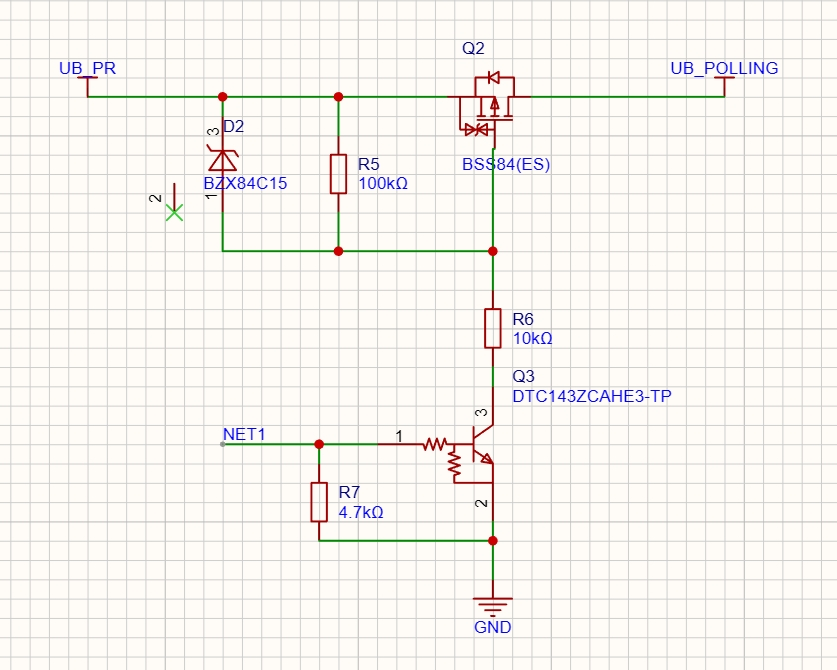
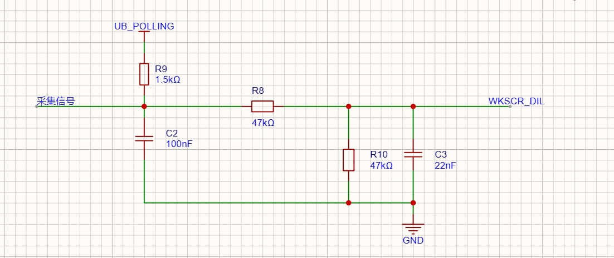

# 电路 02 — USB 轮询控制 & 唤醒调理

> 用 P-MOS 做受控开关 + NPN 做驱动 + Zener 做保护，输出 UB_POLLING 控制 USB。后面接一级 AC 耦合 + RC 滤波，提取唤醒边沿给 MCU。

---

## 原理图



---

## 第一部分：开关控制（UB_POLLING 输出）

### 跟着信号走

```
UB_PR（供电 12V）──→ Q2(P-MOS) 源极 → 漏极 ──→ UB_POLLING（输出）
                         ↑
                   栅极 ←┬─ R5(100K) 上拉到 UB_PR
                         │
                         └─ R6(10K) → Q3(NPN) 集电极 → 发射极 → GND
                                            ↑
                                   基极 ← R7(4.7K) ← NET1(MCU GPIO)
```

**NET1 = H**：Q3 导通 → Q3 集电极 ≈ 0V → Q2 栅极经 R6 被拉到 ≈ 0V → $V_{GS} \approx -12V$ → P-MOS 导通 → UB_POLLING ≈ UB_PR

**NET1 = L**：Q3 截止 → R5 把 Q2 栅极拉到 UB_PR → $V_{GS} \approx 0$ → P-MOS 截止 → UB_POLLING 高阻

| NET1 | Q3 | Q2 栅极 | Q2 | UB_POLLING |
|:--|:--|:--|:--|:--|
| H | 导通 | ≈0V | **导通** | ≈ UB_PR |
| L | 截止 | ≈ UB_PR | **截止** | 高阻 |

---

## 第二部分：唤醒调理（UB_POLLING → WKSCR_DIL）



UB_POLLING 建立之后，采集信号的边沿通过调理电路送到 MCU 的唤醒引脚：

```
采集信号 ── C2(100nF) ──┬── R8(47K) ──→ WKSCR_DIL（MCU 唤醒）
                        │
UB_POLLING ── R9(1.5K) ─┤
                        │
                        ├── R10(47K) ── GND
                        │
                        └── C3(22nF) ── GND
```

### 逐个器件

| 器件 | 干什么 | 为什么 |
|:--|:--|:--|
| C2 100nF | AC 耦合 | 只让边沿通过，挡住直流。USB 插拔产生的跳变才能唤醒 MCU，稳态不唤醒 |
| R9 1.5K | DC 偏置 | C2 耦合后信号浮空，拉到 UB_POLLING 给一个参考电平 |
| R8 47K | 限流 | 防止瞬态过冲直接灌入 MCU 引脚 |
| R10 47K + C3 22nF | RC 低通 | $f_c \\approx 154$Hz，滤高频噪声和振铃 |

### 完整联动流程

```
MCU 拉高 NET1
  → Q3 导通 → Q2 导通 → UB_POLLING = UB_PR（开关闭合）
    → R9 上拉提供偏置
      → 采集信号有边沿 → C2 耦合 → R8 → WKSCR_DIL
        → MCU 唤醒 → 开始 USB 枚举
```

---

## 每个器件为什么选这个值

### Q2 = BSS84（P-MOS，不是 BJT）

为什么这里用 MOSFET 而不是三极管？因为后面的调理电路和 USB 负载可能需要一定的驱动能力。

| BSS84 关键参数 | 值 | 够用吗 |
|:--|:--|:--|
| $V_{DS}$ | -50V | 12V 系统管够 |
| $V_{GS(th)}$ | -0.8~-2V（典型 -1.5V） | 3.3V GPIO 经由 NPN 拉低后 $V_{GS} \\approx -12V$ ，远超阈值 |
| $R_{DS(on)}$ | 10Ω @ $V_{GS}$=-5V | 轻载压降忽略不计 |

### Q3 = DTC143ZCAHE3-TP（NPN 数字管）

这颗料内置了 4.7K 基极电阻。好处：一颗料顶「三极管 + 电阻」，少焊一个 0402。外接 R7=4.7K 和内置的串联，总基极电阻 9.4K。NET1=3.3V 时基极电流 ~0.28mA，足够让 Q3 饱和导通。

### R5 = 100K（栅极上拉）

Q3 截止时，R5 把 Q2 栅极拉到 UB_PR，$V_{GS} \\approx 0$ ，P-MOS 可靠关断。

- 100K 够大：Q3 导通时流过 R5 的电流仅 12V/100K = 0.12mA
- 100K 够小：栅极电容 ~20pF，$\\tau = 100K \\times 20pF = 2\\mu s$ ，开关够快

### D2 = BZX84C15（15V Zener）

保护 Q2 的栅极。BSS84 的 $V_{GS(max)} = \\pm 20V$ ，正常工作时栅极在 0~12V 之间，没事。万一 UB_PR 异常飙到 20V+，Zener 在 15V 击穿钳位，保栅极不穿。

> 15V 的选取逻辑：高于正常工作电压（12V），低于栅极耐压（20V），留 5V 余量。

### R6 = 10K

Q3 集电极到 Q2 栅极，限流。Q3 导通时集电极电流 $(12-0)/10K = 1.2mA$ ，Q3 的 100mA 额定完全够。

---

## 信号时序

| 阶段 | NET1 | Q3 | Q2 栅极 | Q2 | UB_POLLING |
|:--|:--|:--|:--|:--|:--|
| 空闲 | L | 截止 | ≈ UB_PR | 截止 | 高阻 |
| 使能 | L→H | 导通(μs) | ≈ 0V | 导通 | ≈ UB_PR |
| 稳定 | H | 导通 | ≈ 0V | 导通 | ≈ UB_PR |
| 关闭 | H→L | 截止 | → UB_PR | 截止 | 高阻 |

---

## 调试

### UB_POLLING 始终为低

NET1 确实是低？Q3 有没有击穿短路？Q2 的 G-S 有没有击穿？

### UB_POLLING 始终为高

NET1 有没有拉高？Q3 基极有没有电压（查 R7）？R5 有没有开路导致栅极浮空？

### 能唤醒但经常误触发

查 C3（滤波电容）焊上了没。154Hz 的截止频率没有滤波的话，噪声边沿也能触发唤醒。

---

## 面试怎么聊

> "我做过一个 USB 轮询控制电路，分成两部分：开关级和唤醒调理。开关级用 P-MOS（BSS84）做主开关，NPN 数字管（DTC143Z）做驱动——MCU 的 3.3V GPIO 控制 NPN，NPN 拉低 P-MOS 栅极，P-MOS 导通输出 UB_POLLING。栅极有 15V Zener 保护，防止抛负载打穿。
>
> 唤醒调理用 AC 耦合（100nF）提取边沿，经 RC 低通（154Hz）滤噪后送 MCU 唤醒引脚。USB 插拔事件 → MCU 被唤醒 → 开始枚举。"

体现的能力：MOSFET 开关设计、Zener 保护选型、AC 耦合/RC 滤波、数字管（BRT）选型、USB 唤醒机制理解。

---

| 维度 | 参数 |
|:--|:--|
| 输入电压 | 5V ~ 18V |
| 输出电流 | BSS84 连续 ~130mA |
| 开关速度 | μs 级 |
| 工作温度 | -40 ~ +125°C |
| 适用场景 | USB 电源控制、外设使能、唤醒检测 |
